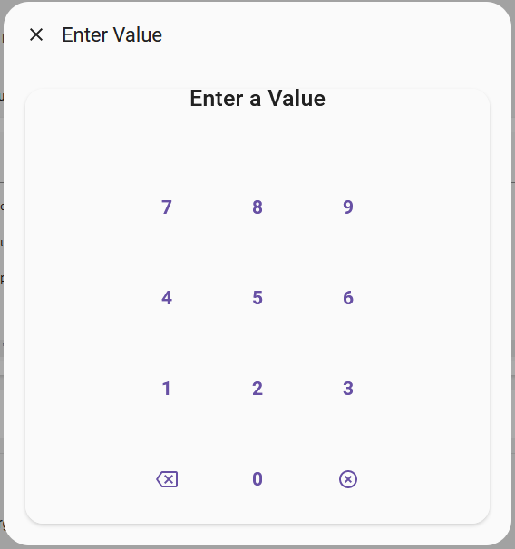
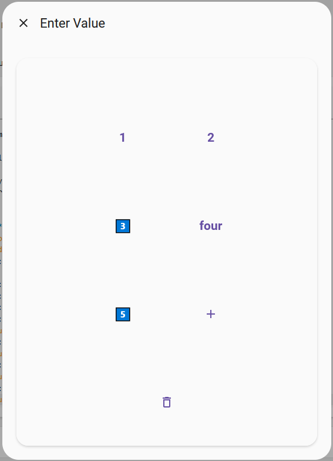

# Home Assistant Keypad

[![hacs][hacsbadge]][hacs]
[![HACS Validation][validation-shield]](validation)

[![GitHub Release][releases-shield]][releases]
[![License][license-shield]](LICENSE)

A simple keypad [selector](https://www.home-assistant.io/docs/blueprint/selectors/) for Home Assistant. Allows you to add a keypad for text input. Primarily built for use with [Browser Mod](https://github.com/thomasloven/hass-browser_mod) when using [form content](https://github.com/thomasloven/hass-browser_mod/blob/master/documentation/popups.md#form-content) but can be used anywhere a selector can.

## Examples

### Basic


```
service: browser_mod.popup
data:
  title: Enter Value
  content:
    - name: my_keypad
      label: Enter a Value
      selector:
        keypad:
          mask: '*'
```
<br clear="both"/>

### Kitchen Sink



```
service: browser_mod.popup
data:
  title: Enter Value
  content:
    - name: my_keypad
      label: Enter a Value
      selector:
        keypad:
          mask: '*'
          show_label: false
          show_code: true
          columns: 2
          keys:
            - key: 1
            - key: "2"
            - key: 3️⃣
            - key: "four"
              value: 4
            - key: 5️⃣
              value: "five"
            - key: mdi:plus
              value: 6
            - key: mdi:delete-outline
              value: __CLEAR__
```
<br clear="both"/>

## Installation

### Manually
1. Copy the files from the `dist` directory to the `<config>/www/`
1. Add the following to the `configuration.yaml` file:
    ```
    lovelace:
    resources:
        - url: /local/ha-selector-keypad.js?v=1
        type: module
    ```

Note: You can place the files into a sub directory under `<config>/www/<sub-directory>`. If you choose this option ensure the path in the `configuration.yaml` file reflects this. Eg.:
```
lovelace:
  resources:
    - url: /local/<sub-directory>/ha-selector-keypad.js?v=1
      type: module
```

### Via HACS
1. Add the repository to HACS
1. Add the following to the `configuration.yaml` file:
    ```
    lovelace:
    resources:
        - url: /hacsfiles/ha-selector-keypad.js
        type: module
    ```

## Configuration Options

### Keypad
Name | Type | Description | Default
-- | -- | -- | -- 
`columns` | number | The maximum number of keys a row can have. | 3
`mask` | string | A character or string to mask the code value when it's displayed. If `null` the raw code value is displayed. This only changes the display of the code not it's internal value. | `null` |
`show_code` | boolean | A flag to render the code section or not | `true`
`show_label`| boolean | A flag to render the label section or not | `true`
`keys` | array | An array of key configurations. | `null`*

* When no keys are specified the default keypad is used (number 0 through 9, delete, and clear)

### Keys
The keys of the keypad can be completely customized by specifying the `keys` array. Keys are read from left to right and top to bottom based on the `columns` value. Each key requires a label and has an optional `value` field that allows for a different value to be used when the key is pressed. This results in two different formats `keys` can be specified and are described below.

#### Short Format
In the short format there is no distinction between label and value, they are considered the same. The value specified for the key will also be the label. 

```
- key: 1
- key: "Abc"
- key: "mdi:plus"
```

#### Full Format
In the full format you specify the label and the value explicitly. The value can be a `string` or `number`.

```
- key: 1
  value: 5
- key: "Abc"
  value: 7
- key: "mdi:plus"
  value: "+"
```

#### Values
Values can be a `string` or a `number`. In the short format if an icon is specified the string name of the icon, eg. `mdi:plus`, is used. There are two special values for the delete key and the clear key:
- `__DELETE__`
- `__CLEAR__`

The labels for these can be customized the same as regular keys and will default to `mdi:backspace-outline` and `mdi:close-circle-outline`.

As values can contain multiple characters, eg `abc` or `123`, each value is treated as a single token and all of the logic in the keypad works off of tokens. For example, when masking a key with a value of `123` with the `*` character you would only see 1 `*` each time you pressed that key. The delete key works in a similar way, if you pressed the same key twice (without a mask) you would see `123123` then pressed delete the resulting code would be `123`.

## Styling Options

### General
Variable | Description | Default
-- | -- | -- 
`--hakp-font-family` | The font family of the entire control | `Roboto`
`--hakp-text-color` | The text color for the entire control | `--primary-text-color` or `rgb(221, 221, 221)`

### Code Display
Variable | Description | Default
-- | -- | -- 
`--hakp-code-font-size` | The font size of the code | `2.5rem`
`--hakp-code-font-weight` | The font weight of the code | `600`
`--hakp-code-color` | The text color of the code | `--hakp-text-color`

### Code Label
Variable | Description | Default
-- | -- | -- 
`--hakp-code-label-font-size` | The font size of the label | `1.75rem`
`--hakp-code-label-font-weight` | The font weight of the label | `500`
`--hakp-code-label-color` | The text color of the label | `--hakp-text-color`

### Keypad
Variable | Description | Default
-- | -- | -- 
`--hakp-keypad-max-width` | The maximum width of the keypad | `300px`

### Keys
Variable | Description | Default
-- | -- | -- 
`--hakp-key-font-size` | The font size of the key | `1.5rem`
`--hakp-key-font-weight` | The font weight of the key | `600`
`--hakp-key-color` | The text color of the key | `--hakp-text-color`
`--hakp-key-padding` | The padding around the key | `8px`

[releases-shield]: https://img.shields.io/github/release/amura11/ha-selector-keypad.svg?style=for-the-badge
[releases]: https://github.com/amura11/ha-selector-keypad/releases
[hacs]: https://github.com/hacs/integration
[hacsbadge]: https://img.shields.io/badge/HACS-Custom-orange.svg?style=for-the-badge
[validation-shield]: https://img.shields.io/github/actions/workflow/status/amura11/ha-selector-keypad/validate.yaml?style=for-the-badge&label=HACS%20Validation
[validation]: https://github.com/amura11/ha-selector-keypad/actions/workflows/validate.yml
[license-shield]: https://img.shields.io/github/license/amura11/ha-selector-keypad.svg?style=for-the-badge
